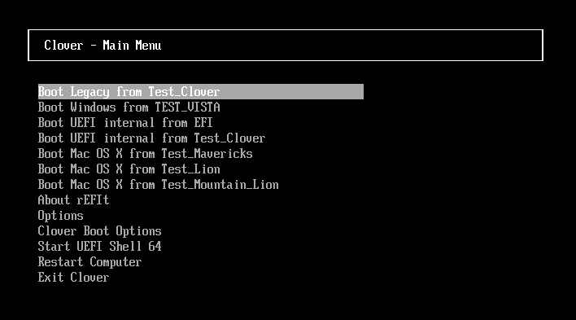
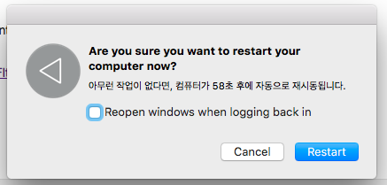

# Описание параметров файла config.plist

## Оглавление

[1. GUI](#1-gui)
- [1.1 TextOnly](#11-textonly)
- [1.2 ConsoleMode](#12-consolemode)
- [1.3 Theme](#13-theme)
- [1.4 EmbeddedThemeType](#14-embeddedthemetype)
- [1.5 Timezone](#15-timezone)
- [1.6 PlayAsync](#16-playasync)
- [1.7 CustomIcons](#17-customicons)
- [1.8 ScreenResolution](#18-screenresolution)
- [1.9 ProvideConsoleGop](#19-provideconsolegop)
- [1.10 KbdPrevLang](#110-kbdprevlang)
- [1.11 Language](#111-language)
- [1.12 Mouse](#112-mouse)
    * [1.12.1 Enabled](#1121-enabled)
    * [1.12.2 Speed](#1122-speed)
    * [1.12.3 Mirror](#1123-mirror)
- [1.13 Hide](#113-hide)
- [1.14 Scan](#114-scan)
    * [1.14.1 Legacy](#1141-legacy)
    * [1.14.2 Entries](#1142-entries)
    * [1.14.3 Tool](#1143-tool)
    * [1.14.4 Linux](#1144-linux)
    * [1.14.5 Kernel](#1145-kernel)
- [1.15 Custom](#115-custom)
    * [1.15.1 Entries](#1151-custom)
    * [1.15.2 Legacy](#1152-legacy)
    * [1.15.3 Tool](#1153-tool)
- [1.16 ShowOptimus](#116-showoptimus)
[2. Boot](#2-boot)
- [2.1 Timeout](#21-timeout)
- [2.2 Fast](#22-fast)
- [2.3 DefaultVolume](#23-defaultvolume)
- [2.4 DefaultLoader](#24-defaultloader)

### 1. GUI

- **Описание**:

    Группа параметров, с помощью которых можно настроить вид загрузчика Clover.

//TODO: добавить пример кода со всеми параметрами из данной группы со значениями по умолчанию

#### 1.1 TextOnly

- **Тип значения**: `boolean`
- **Значение по умолчанию**: `false`
- **Возможные значения**: `false`, `true`
- **Описание**:

    Данный параметр позволяет отображать интерфейс загрузчика в текстовом режиме. Если стоит `false`, то Clover работает в графическом режиме. Разрешение текстового экрана, здесь, а также в Shell.efi и на экране boot.efi, можно установить с помощью параметра *ConsoleMode*.

- **Пример кода**:

    ```xml
    <key>TextOnly</key>
    <false/>
    ```

- **Пример результата применения**:



#### 1.2 ConsoleMode

- **Тип значения**: `string`
- **Значение по умолчанию**: `0`
- **Возможные значения**: `0`, `Min`, `Max`, `[number]`
- **Описание**:

    Переключит драйвер консоли в требуемый режим консоли (который используется оболочкой, boot.efi, shell.efi, dumpueficalls и т.д.). Обычно в этом нет необходимости, и следует использовать только там, где это необходимо.

- **Пример кода**:

    ```xml
    <key>ConsoleMode</key>
    <string>0</string>
    ```

#### 1.3 Theme

- **Тип значения**: `string`
- **Значение по умолчанию**: `embedded`
- **Возможные значения**: `random`, `embedded`, `[text]`
- **Описание**:

    Если вы не включили текстовый режим загрузчика Clover, то оформление графической оболочки будет зависеть от выбранной темы. Значение данного параметра это имя папки в `/CLOVER/themes`, которая содержит соответствующую структуру файлов.

    //TODO: добавить ссылку на инструкцию по созданию темы и theme.plist

    //TODO: добавить ссылку на информацию о контрольной панели

    Тему можно выбрать в Контрольной панели Clover, и оно будет определяющим, в независимости от того, какая тема написана в config.plist. Если указана неправильная тема (в указанной папке нет файла theme.plist), то будет выбрана тема из config.plist. Если и там указана неверная тема, то будет отображаться встроенная `embedded` тема (последний вариант от Clovy). Так же, начиная с ревизии 1955 тему можно сменить и в самом загрузчике, перейдя в `Options -> GUI tuning -> Themes`. После выбора темы и перехода на начальный экран загрузчика, выбранная тема сразу применится и вид загрузчика изменится.

    Тему можно скачать и установить вручную просто скачав архив с нужной темой, распаковав его в папку `/CLOVER/themes` и указав название папки с файлами темы параметре `Theme`. Официальный список и содержимое тем есть в [github](https://github.com/CloverHackyColor/CloverThemes) репозитории загрузчика (так же хранилище тем есть на [SourceForge](https://sourceforge.net/p/cloverefiboot/themes/ci/master/tree/themes/), но это устаревший вариант, т.к. он давно никем не обновляется) или в соответствующей теме форума [insanelymac](https://www.insanelymac.com/forum/topic/288685-clover-themes/). Так же есть приложения для удобного просмотра тем и их автоматической настройки - [Clover.app](https://www.insanelymac.com/forum/topic/341047-cloverapp-testing/) и [Clover Theme Manager](https://www.insanelymac.com/forum/topic/302674-clover-theme-manager/) (он вроде бы устарел).

    Если вписать значение `random`, то при каждой загрузки в Clover будет использоваться случайная тема из тех, что находятся в `CLOVER/themes`.

    Если ваш монитор имеет разрешение, например 2560х1600 или 4K, то
    иконки и текст на экране будет слишком мелким. Чтобы это исправить, нужно использовать тему с более крупными значками и более крупным размером текста. Начиная с ревизии 4438 загрузчик Clover может самостоятельно на большом мониторе использовать крупную тему, а на маленьких - обычную тему. Крупная тема должна называться также, как и обычная, но с приставкой *@2x*. Например в параметре `Theme` указано значение `metal` и тогда для мониторов с небольшим разрешением Clover будет использовать файлы из папки `/CLOVER/themes/metal`, а для мониторов с большим разрешением Clover будет использовать файлы из папки `/CLOVER/themes/metal@2x`. Критерий "большого" монитора это количество пикселей больше 1100 по высоте.

    Начиная с ревизии 4862 загрузчик Clover стал поддерживать масштабируемые, т.е. векторные темы. В векторных темах используется файл *theme.svg*, а в обычной растровой файл *theme.plist*. По наличию этих файлов Clover и отличает какая тема находится в папке. Сами же векторные темы начали внедрятся начиная с ревизии 4279 ([пост](https://www.insanelymac.com/forum/topic/304530-clover-change-explanations/?do=findComment&comment=2644821) на insanelymac об этом).

- **Пример кода**:

    ```xml
    <key>Theme</key>
    <string>BGM</string>
    ```

#### 1.4 EmbeddedThemeType

- **Тип значения**: `string`
- **Значение по умолчанию**: `DayTime`
- **Возможные значения**: `DayTime`, `Dark`, `Light`
- **Описание**:

    С помощью значений `Dark` и `Light` в данном параметре можно включить светлую или темную версию выбранной темы (конечно, если в теме присутствует светлая и темная версия). Если выбранная тема не сделана с учетом темной и светлой версии, то просто в любом случае будет отображаться единственный вариант этой темы. Данный параметр добавлен в ревизии 4644.

    В ревизии 4773 добавлено значение `DayTime` ([пост](https://www.insanelymac.com/forum/topic/304530-clover-change-explanations/?do=findComment&comment=2649548) на insanelymac об этом). Если выбрано данное значение, то темная и светлая версия выбранной темы переключается в зависимости от времени суток, по аналогии с Mojave. Clover включает светлую версию темы в промежутке от 8:00 до 20:00.

- **Пример кода**:

    ```xml
    <key>EmbeddedThemeType</key>
    <string>DayTime</string>
    ```

#### 1.5 Timezone

- **Тип значения**: `integer`
- **Значение по умолчанию**: `3`
- **Возможные значения**: `+3`, `-5`, `[number]`
- **Описание**:

    Этот параметр актуально использовать только в паре с `EmbeddedThemeType` со значением `DayTime`. При запуске Clover считывает время из BIOS (оно обычно по Гринвичу) и прибавляет число из этого параметра и в сумме получается локальное время. Значения можно писать со знаком `+` или со знаком `-` или без знака (что равносильно знаку `+`). Параметр добавлен в ревизии 4773 ([пост](https://www.insanelymac.com/forum/topic/304530-clover-change-explanations/?do=findComment&comment=2649548) на insanelymac об этом).

- **Пример кода**:

    ```xml
    <key>Timezone</key>
    <integer>3</integer>
    ```

#### 1.6 PlayAsync

- **Тип значения**: `boolean`
- **Значение по умолчанию**: `false`
- **Возможные значения**: `false`, `true`
- **Описание**:

    В зависимости от значения в этом параметре, Clover определяет проигрывать звук синхронно со своей работой или асинхронно.

    При синхронном воспроизведении ничего не работает, пока звуковая дорожка не закончится. То есть при синхронном режиме даже GUI загрузчика Clover не отобразится, пока вся аудиодорожка не проиграет.

    При асинхронном воспроизведении звук играет независимо от действий, происходящих на экране. Звук начинает играть после появления на экране сообщения `...scan entries...` затем появляется интерфейс Clover, воспроизведение звука продолжается, затем появляются строчки работы boot.efi, воспроизведение звука продолжается, затем запускается ядро, и по очереди запускаются кексты. Начиная с какого-то из них, воспроизведение звука обрывается. Ну это, разумеется, если аудиодорожка в файле *sound.wav* длинная.

    Сама функция воспроизведения звука во время загрузки Clover добавлена в ревизии 4833 ([пост](https://www.insanelymac.com/forum/topic/304530-clover-change-explanations/?do=findComment&comment=2657187) на insanelymac об этом) и она работает при наличии драйвера `AudioDxe.efi` (автор Goldfish64). Этот параметр добавлен в Clover в ревизии 4840 ([пост](https://www.insanelymac.com/forum/topic/304530-clover-change-explanations/?do=findComment&comment=2657772) на insanelymac об этом).

    Clover ревизии 4862 имел баг и включенный параметр `PlayAsync` (именно со значением `true`) вызывал не давал правильно работать компьютеру. В ревизии 4870 этот баг исправили.

- **Пример кода**:

    ```xml
    <key>PlayAsync</key>
    <false/>
    ```

#### 1.7 CustomIcons

- **Тип значения**: `boolean`
- **Значение по умолчанию**: `false`
- **Возможные значения**: `false`, `true`
- **Описание**:

    Этот параметр используется для отображения кастомных иконок у разделов диска. Если значение `true`, то для каждого раздела с операционной системой будет выполняться поиск иконки `.VolumeIcon.icns` в корне раздела и использоваться вместо иконок, заданных темой.

- **Пример кода**:

    ```xml
    <key>CustomIcons</key>
    <false/>
    ```

#### 1.8 ScreenResolution

- **Тип значения**: `string`
- **Значение по умолчанию**: `1280x1024`
- **Возможные значения**: `1280x1024`, `1920x1080`, `[text]`
- **Описание**:

    Этот параметр позволяет установить разрешение экрана в меню загрузчика Clover. Clover пытается выставить наибольшее возможное разрешение, однако, он может ошибиться. Проверяйте список доступных режимов в boot.log.

    Если в секции Graphics параметр `PatchVBios` имеет значение `true`, то у вас появится максимальное разрешение, доступное для данного монитора. В этом случае параметр `ScreenResolution` может оказаться лишним. С некоторыми конфигурациями параметр `PatchVBios` может быть фатальным - будет отображаться черный экран без признаков жизни.

    При использовании данного параметра есть одна тонкость. Загрузчику Clover должен быть известен EDID монитора. Legacy Clover пытается его получить через вызовы INT10 BIOS, часто это успешно, иногда неуспешно. UEFI CLover запрашивает данные у UEFI BIOS, который наверняка знает EDID для встроенной видеокарты, и наверняка не знает для вставленной. Смотрите *preboot.log*, и если там нет EDID, то вписывайте его вручную.

//TODO: добавить ссылки на EDID и на PatchVBios

- **Пример кода**:

    ```xml
    <key>ScreenResolution</key>
    <string>1280x1024</string>
    ```

#### 1.9 ProvideConsoleGop

- **Тип значения**: `boolean`
- **Значение по умолчанию**: `true`
- **Возможные значения**: `true`, `false`
- **Описание**:

    Этот параметр создает протокол GOP для режима консоли [ConsoleMode](#12-consolemode), то есть, чтобы вывод текста был не в текстовом режиме, как привыкли делать в PC BIOS, а в графическом, как это делает Apple.

    В некоторых ревизиях Clover, этот параметр дублировался с квирком `ProvideConsoleGopEnable`, но начиная с ревизии 5128 этот параметр убран из списка квирков и есть только в разделе [GUI](#1-gui) с немного другим названием. Значение параметра `ProvideConsoleGop` из раздела [GUI](#1-gui) будет переопределять значение параметра `ProvideConsoleGopEnable` из списка квирков, если вдруг вы забыли убрать этот параметр из конфига при обновлении загрузчика.

    Параметр лучше не выключать, нет адекватных аргументов в пользу его выключения.

- **Пример кода**:

    ```xml
    <key>ProvideConsoleGop</key>
    <true/>
    ```

#### 1.10 KbdPrevLang

- **Тип значения**: `boolean`
- **Значение по умолчанию**: `false`
- **Возможные значения**: `false`, `true`
- **Описание**:

    Этот параметр используется для исправлению языковых проблем macOS при использовании нативного NVRAM. Этот баг macOS существует уже давно. Включите этот параметр (задайте значение `true`), если вы хотите сохранить язык системы при обновлении macOS с помощью встроенного NVRAM.

    Этот параметр работает **только при использовании** `AptioMemoryFix` или `OsxAptioFixV3` без `EmuVariableuefi.efi`, т.е. нужен "железный" NVRAM. И также параметр работает при использовании языка, отличного от английского.

    Рекомендуется всегда сохраняйте английский язык при обновлении macOS в режиме восстановления, несмотря на то, что пользователь уже использует другой язык в macOS.

    Этот параметр добавлен в ревизии 4719 разработчиком [Sherlocks](https://www.insanelymac.com/forum/profile/980913-sherlocks/). В [посте на insanelymac](https://www.insanelymac.com/forum/topic/304530-clover-change-explanations/?do=findComment&comment=2642596) он описал свойства этого параметра.

    Вы можете исправить проблемы ниже, используя этот ключ:
    ```xml
    <key>GUI</key>
        <dict>
            <key>KbdPrevLang</key>
            <true/>
            <key>Language</key>
            <string>ru:0</string>          <----- you want language
        </dict>
    ```

- **Пример проявления проблемы**:



- **Пример кода**:

    ```xml
    <key>ProvideConsoleGop</key>
    <true/>
    ```

#### 1.11 Language

- **Тип значения**: `string`
- **Значение по умолчанию**: `ru:0`
- **Возможные значения**: `ru:0`, `en:0`, `fr:0`, `it:0`, `es:0`, `pt:0`, `br:0`, `de:0`, `nl:0`, `pl:0`, `ua:0`, `cz:0`, `hr:0`, `id:0`, `ko:0`, `[text]`
- **Описание**:

    На данный момент установка языка с помощью этого параметра имеет смысл только для меню "Help" вызываемого по клавише F1. Также, это значение передается в систему, и может повлиять на язык по умолчанию.

- **Пример кода**:

    ```xml
    <key>Language</key>
    <string>ru:0</string>
    ```

#### 1.12 Mouse

- **Описание**:

    Группа параметров, с помощью которых можно настроить работу мыши и курсора в меню загрузчика Clover

//TODO: добавить пример кода со всеми параметрами из данной группы со значениями по умолчанию

##### 1.12.1 Enabled

- **Тип значения**: `boolean`
- **Значение по умолчанию**: `true`
- **Возможные значения**: `true`, `false`
- **Описание**:

    Этот параметр включает работу мыши и, соответственно, отображение курсора в меню Clover. От того, включен ли этот параметр имеет смысл включение других параметров в этой категории.

- **Пример кода**:

    ```xml
    <key>Enabled</key>
    <true/>
    ```

##### 1.12.2 Speed

- **Тип значения**: `integer`
- **Значение по умолчанию**: `2`
- **Возможные значения**: `2`, `3`, `4`, `5`, `6`, `7`, `8`, `[number]`
- **Описание**:

    Этот параметр корректирует скорость перемещения мыши в меню Clover. Разумные значения от 2 до 8 включительно. Для некоторых мышей требуется отрицательная скорость, перемещение в обратном направлении. Значение 0 означает, что мышь отключена.

- **Пример кода**:

    ```xml
    <key>Speed</key>
    <integer>2</integer>
    ```

##### 1.12.3 Mirror

- **Тип значения**: `boolean`
- **Значение по умолчанию**: `false`
- **Возможные значения**: `false`, `true`
- **Описание**:

    Этот параметр включает зеркальное перемещение курсора, то есть перемещение в обратном направлении от того, куда вы двигаете курсор.

- **Пример кода**:

    ```xml
    <key>Mirror</key>
    <false/>
    ```

#### 1.13 Hide

- **Тип значения**: `array`
- **Значение по умолчанию**:
- **Возможные значения**: `WindowsHDD`, `BOOTX64.EFI`, `E223FF7F-F2DA-4DBB-B765-756F2D95B0FE`, `[text]`
- **Описание**:

    Этот параметр позволяет скрыть отображение определенных разделов в меню Clover, указав имя раздела или его *GUID*. Таким образом вы сможете убрать из меню отображение ненужных разделов, например *Recovery* или *Preboot*.

    В интерфейсе загрузчика Clover можно увидеть *legacy* и *UEFI* загрузчики для установленных операционных систем. При этом на одном разделе может быть и несколько загрузчиков. Может быть, вам и не нужно видеть все, что нашел Clover, и вам достаточно отображение пары реальных систем. Вы можете скрыть из интерфейса как отдельные разделы, так и целые классы загрузчиков.

- **Пример кода**:

    ```xml
    <key>Hide</key>
    <array>
        <string>WindowsHDD</string>
        <string>BOOTX64.EFI</string>
        <string>E223FF7F-F2DA-4DBB-B765-756F2D95B0FE</string>
        <string>HD(1,GPT,E223FF7F-F2DA-4DBB-B765- 756F2D95B0FE)</string>
    </array>
    ```

#### 1.14 Scan

- **Описание**:

    Группа параметров, с помощью которых можно указать загрузчику Clover, что именно сканировать

//TODO: добавить пример кода со всеми параметрами из данной группы со значениями по умолчанию

##### 1.14.1 Legacy

- **Тип значения**: `string`, `boolean`
- **Значение по умолчанию**: `false`
- **Возможные значения**: `No`, `First`, `Last`, `false`
- **Описание**:

    Этот параметр включает или выключает поиск устаревших загрузчиков, запускаемых из PBR. Есть варианты значений No - не показывать вообще эти разделы, First - расположить legacy разделы в начале списка, Last - расположить legacy разделы в конце списка.

- **Пример кода**:

    ```xml
    <key>Legacy</key>
    <false/>
    ```

##### 1.14.2 Entries

- **Тип значения**: `boolean`
- **Значение по умолчанию**: `true`
- **Возможные значения**: `true`, `false`
- **Описание**:

    Этот параметр включает или выключает поиск UEFI записей на каждом разделе при загрузке Clover.

- **Пример кода**:

    ```xml
    <key>Entries</key>
    <true/>
    ```

##### 1.14.3 Tool

- **Тип значения**: `boolean`
- **Значение по умолчанию**: `true`
- **Возможные значения**: `true`, `false`
- **Описание**:

    Этот параметр включает или выключает поиск UEFI инструментов на каждом разделе при загрузке Clover.

- **Пример кода**:

    ```xml
    <key>Tool</key>
    <true/>
    ```

##### 1.14.4 Linux

- **Тип значения**: `boolean`
- **Значение по умолчанию**: `true`
- **Возможные значения**: `true`, `false`
- **Описание**:

    Этот параметр включает или выключает поиск Linux загрузчиков на каждом разделе при загрузке Clover.

- **Пример кода**:

    ```xml
    <key>Linux</key>
    <true/>
    ```

##### 1.14.5 Kernel

- **Тип значения**: `string`
- **Значение по умолчанию**: `All`
- **Возможные значения**: `All`, `Newest`, `Oldest`, `First`, `Last`, `MostRecent`, `Earliest`, `None`
- **Описание**:

    Этот параметр включает или выключает поиск ядра Linux на каждом разделе при загрузке Clover.

    Дополнительно вы можете выбрать один из нескольких вариантов:

    - `All` - все найденные ядра
    - `Newest` - самый свежий измененный файл по дате
    - `Oldest` - самый старый измененный файл по дате
    - `First` - первый совпавший
    - `Last` - последний совпавший
    - `MostRecent` - самая последняя версия
    - `Earliest` - самая ранняя версия
    - `None` - не сканировать ядра

- **Пример кода**:

    ```xml
    <key>Kernel</key>
    <string>All</string>
    ```

#### 1.15 Custom

- **Описание**:

    Группа параметров, с помощью которых можно более тонко настроить интерфейс меню загрузчика, если вы понимаете как и что нужно делать. В нем находится 3 массива. Один элемент массива содержит описание выбранного пункта в виде словаря.

    И каждый пункт меню может содержать еще подпункты (*SubEntries*), которые представляют собой разные варианты вызова основного ключа.

    Возможно вам будет понятней из описания данного параметра на [Sourceforge Wiki](https://sourceforge.net/p/cloverefiboot/wiki/GUI/#custom). Код, отвечающий за эти параметры, разработал Apianti.

##### 1.15.1 Entries

- **Тип значения**: `array`
- **Возможные значения**: смотрите ниже [Описание внутренних параметров](#описание-внутренних-параметров-custom)
- **Пример кода**:

    ```xml
    <key>Entries</key>
    <array>
        <dict>
            <key>Hidden</key>
            <false/>
            <key>Disabled</key>
            <false/>
            <key>Image</key>
            <string>os_mageia</string>
            <key>Path</key>
            <string>\EFI\MAGEIA\GRUBX64.efi</string>
            <key>Title</key>
            <string>Mageia Linux</string>
            <key>Type</key>
            <string>Linux</string>
        </dict>
        <dict>
            <key>Hidden</key>
            <false/>
            <key>Hotkey</key>
            <string>M</string>
            <key>Volume</key>
            <string>D68F1885-571C-4441-8DD5-F14803EFEF54</string>
            <key>Arguments</key>
            <string>Kernel=mach_kernel</string>
            <key>Disabled</key>
            <true/>
            <key>AddArguments</key>
            <string>-v</string>
            <key>Path</key>
            <string>\EFI\BOOT\BOOTX64.efi</string>
            <key>Title</key>
            <string>MyCustomEntry</string>
            <key>NoCaches</key>
            <false/>
            <key>InjectKexts</key>
            <false/>
            <key>Type</key>
            <string>OSXRecovery</string>
        </dict>
        <dict>
            <key>Hidden</key>
            <false/>
            <key>Volume</key>
            <string>454794AC-760D-46E8-8F77-D6EB23D2FD32</string>
            <key>SubEntries</key>
            <array>
                <dict>
                    <key>AddArguments</key>
                    <string>-v</string>
                    <key>Title</key>
                    <string>Boot OS X 10.8.5 (12F36) Mountain Lion in Verbose Mode</string>
                </dict>
            </array>
            <key>Type</key>
            <string>OSX</string>
            <key>Title</key>
            <string>OS X 10.8.5 (12F36) Mountain Lion</string>
            <key>NoCaches</key>
            <false/>
            <key>InjectKexts</key>
            <false/>
        </dict>
    </array>
    ```


##### 1.15.2 Legacy

- **Тип значения**: `array`
- **Возможные значения**: смотрите ниже [Описание внутренних параметров](#описание-внутренних-параметров-custom)
- **Пример кода**:

    ```xml
    <key>Legacy</key>
    <array>
        <dict>
            <key>Hidden</key>
            <false/>
            <key>Hotkey</key>
            <string>L</string>
            <key>Volume</key>
            <string>89433CD3-21F2-4D3C-95FC-722C48066D3A</string>
            <key>Disabled</key>
            <true/>
            <key>Type</key>
            <string>Windows</string>
            <key>Title</key>
            <string>MyLegacyEntry</string>
        </dict>
    </array>
    ```

##### 1.15.3 Tool

- **Тип значения**: `array`
- **Возможные значения**: смотрите ниже [Описание внутренних параметров](#описание-внутренних-параметров-custom)
- **Пример кода**:

    ```xml
    <key>Tool</key>
    <array>
        <dict>
            <key>Hidden</key>
            <false/>
            <key>Hotkey</key>
            <string>S</string>
            <key>Volume</key>
            <string>D68F1885-571C-4441-8DD5-F14803EFEF54</string>
            <key>Arguments</key>
            <string>-b</string>
            <key>Disabled</key>
            <false/>
            <key>Path</key>
            <string>\EFI\CLOVER\TOOLS\Shell64-v1.efi</string>
            <key>Title</key>
            <string>MyCustomShell</string>
        </dict>
    </array>
    ```

##### Описание внутренних параметров Custom:
- `Disabled` - отключает всю структуру и она не принимается во внимание.
- `Volume` - Имя тома или GUID, которые будут использоваться при поиске
загрузчика на разделах дисков.
- `VolumeType` - Тип тома, которому должна соответствовать ваша пользовательская запись. Может быть строкой одного типа или массивом нескольких типов. Допустимые типы томов: `Internal`, `External`, `Optical`, `FireWire`.
- `Path` - Местоположение для сканирования загрузчика efi.
- `Arguments` - Аргументы, которые нужно передать загрузчику. Отменяет аргументы
загрузки по умолчанию в *Boot -> Arguments*.
- `AddArguments` - Добавляет аргументы загрузки по умолчанию. Для SubEntry он
добавляет аргументам к основной записи.
- `Title` -  Изменяет отображаемый заголовок. Использует формат "Boot `Title` from
`VolumeName`"
- `FullTitle` - Устанавливает отображаемый заголовок только "`FullTitle`" без какого либо формата.
- `Image` - Путь к файлу настраиваемого изображения. Путь поиска - это корневой каталог тома записи, каталог тем, каталог клевера, корневой каталог тома клевера и, наконец, имена значков ОС.
- `ImageData` - Встроенное собственное изображение. Может быть в формате `PNG` или
`BMP`, определенная в конфиге как бинарный массив.
- `DriveImage` - Путь к файлу пользовательского картинки диска. Путь поиска - это корневой каталог тома записи, каталог тем, каталог клевера, корневой каталог тома клевера и, наконец, имена значков ОС.
- `DriveImageData` - Встроенный собственная картинка диска. Может быть в формате `PNG` или `BMP`.
- `Hidden` - Скрывает запись. Если значение `true`, запись можно отобразить, нажав `F3` в меню Clover. Если значение равно `Always`, запись никогда не будет отображаться.
- `InjectKexts` - Внедряет кексты. Допустимые варианты: `Yes`, `No` или `Detect`. А еще на какой-то `Entry` можно поставить. Используйте `Detect` для внедрения кекстов, только если *FakeSMC* отсутствует в `KernelCache` или */S/L/E*. Для записей типа `OSX`, `OSXInstaller` и `OSXRecovery`.
- `NoCaches` - Пропустить кеши. Для записей типа `OSX`, `OSXInstaller` и `OSXRecovery`.
- `Kernel` - Установите приоритет сканирования ядра Linux. Если эта опция не указана, Clover покажет все найденные ядра. Допустимые варианты: `Newest`, `Oldest`, `First`, `Last`, `MostRecent`, `Earliest`. Для записей типа `LinuxKernel`.
- `Type` - Тип ОС, на которую выполняется сканирование. Допустимые типы: `OSX`, `OSXInstaller`, `OSXRecovery`, `Windows`, `Linux`, `LinuxKernel`. Если Тип не один из перечисленных, он будет рассматриваться как все типы.
- `BootBgColor` - Задает цвет фона загрузочного экрана. Для записей типа `OSX`, `OSXInstaller` и `OSXRecovery`.
- `CustomLogo` - Определяет стиль логотипа загрузочного экрана. Для получения
дополнительной информации прочтите `Boot -> CustomLogo`.
- `SubEntries` - По умолчанию: `true`. Отключает вложенные записи по умолчанию, если установлено значение `false`. Может также использоваться для создания настраиваемых вложенных записей с использованием той же структуры, что и основная запись, любые настройки, которые не установлены во вложенной записи, будут унаследованы от основной записи.
- `KernelAndKextPatches` - Использует ту же иерархию и предлагает те же функции, что и `KernelAndKextPatches`, поэтому вы можете выборочно применять исправления для каждой записи. Работает только с версией 2797 или выше.
- `Ignore` - Запись будет проигнорирована или не использована, поэтому ни на что не повлияет.
- `Hotkey` - ?

//TODO: добавить ссылки якорные на аналогичные пункты из конфига

#### 1.16 ShowOptimus

- **Тип значения**: `boolean`
- **Значение по умолчанию**: `false`
- **Возможные значения**: `false`, `true`
- **Описание**:

    Этот параметр в зависимости от того, работает у вас встроенная и дискретная видеокарта или только одна из них, отображает слово *Intel* или *Discrete* в меню загрузчика Clover внизу по середине.

    Если работает графика Intel + дискретная видеокарта, то на экрана отображается слово *Intel*. Если работает только дискретная графика, то отображается слово *Discrete*.

    Этот параметр добавлен в ревизии 4221 и изначально этот параметр предназначался для использования на ноутбуках, потому что на некоторых ноутбуках есть возможность отключить работу режима *Optimus* в BIOS, но иногда он самопроизвольно включается. И вместо слова *Intel* отображалось слово *Optimus*.

- **Пример кода**:

    ```xml
    <key>ShowOptimus</key>
    <false/>
    ```

## 2. Boot

- **Описание**:

    Группа параметров, с помощью которых можно настроить параметры загрузки операционных систем из меню Clover.

//TODO: добавить пример кода со всеми параметрами из данной группы со значениями по умолчанию

### 2.1 Timeout

- **Тип значения**: `integer`
- **Значение по умолчанию**: `5`
- **Возможные значения**: `5`, `3`, `0`, `-1`, `237`, `[number]`
- **Описание**:

    Этот параметр позволяет указать сколько секунд надо подождать прежде чем запустить выбранную в меню Clover операционную систему. Отсчет начинается сразу после того, как загрузчик перешел в графический (или [текстовый](#11-textonly)) режим. Если в течении указанного времени пользователь нажмет какую-либо клавишу на клавиатуре или мышке, то отсчет времени прекратится.

    Если задано значение `0`, то вы не увидите меню Clover, выбранная по умолчанию для загрузки система сразу будет загружаться. Однако, если нажать (или зажать) пробел - отобразится меню Clover. Этот параметр с этим значением аналогичен параметру [Fast](#22-fast) со значением `true`.

    Если установлено значение `-1`, то появится меню Clover, но попыток старта происходить не будет.

    Бывает, что из-за тяжелой анимации таймер тикает медленнее, чем 1Гц. Это зависит от темы.

    Задержка не работает, если в NVRAM не определена система по умолчанию. Один из вариантов решить эту проблему - зайти в систему, в системную панель "Загрузочный Диск", и перезагрузиться в помощью нее. В следующий раз `Timeout` будет работать!

- **Пример кода**:

    ```xml
    <key>Timeout</key>
    <integer>5</integer>
    ```

### 2.2 Fast

- **Тип значения**: `string`
- **Значение по умолчанию**: `false`
- **Возможные значения**: `false`, `true`
- **Описание**:

    С включением этого параметра система, начнет запускаться с раздела, заданного в параметре [DefaultVolume](23-defaultvolume) сразу после запуска компьютера.

    В отличие от параметра [Timeout](21-timeout) со значением `0`, при выставлении значения `true` для параметра `Fast` производится дополнительная экономия времени загрузки на том, чтобы не загружать интерфейс и его элементы. Т.е. уже невозможно будет зайти в меню Clover и невозможно будет что-то поправить в случае ошибки.

- **Пример кода**:

    ```xml
    <key>Fast</key>
    <false/>
    ```

### 2.3 DefaultVolume

- **Тип значения**: `string`
- **Значение по умолчанию**: `LastBootedVolume`
- **Возможные значения**: `LastBootedVolume`, `Macintosh HD`, `57272A5A-7EFE-4404-9CDA-C33761D0DB3C`, `HD(1,GPT,57272A5A-7EFE-4404-9CDA-C33761D0DB3C,0x800,0xFF000)`, `[text]`
- **Описание**:

    Этот параметр используется, чтобы указать, какой раздел является загрузочным по умолчанию в Clover.

    В качестве значений, можно указать:
    - имя раздела, например `Macintosh HD`.
    - *GUID* раздела, например `57272A5A-7EFE-4404-9CDA-C33761D0DB3C`. Точное значение можно узнать, например в `preboot.log` или `debug.log` или `Clover boot log`.
    - часть пути к устройству, например `HD(1,GPT,57272A5A-7EFE-4404-9CDA-C33761D0DB3C,0x800,0xFF000)`. Точное значение можно узнать, например в `preboot.log` или `debug.log` или `Clover boot log`.
    - `LastBootedVolume` - означает выбрать тот раздел, который был запущен после последнего запуска компьютера.

    Однако, имя может быть также задано в NVRAM после перезагрузки из контрольной панели "Загрузочный Диск". Имя, заданное в NVRAM является приоритетным.

- **Пример кода**:

    ```xml
    <key>DefaultVolume</key>
    <string>LastBootedVolume</string>
    ```

### 2.4 DefaultLoader

- **Тип значения**: `string`
- **Значение по умолчанию**: `boot.efi`
- **Возможные значения**: `boot.efi`, `bootmgfw.efi`, `[text]`
- **Описание**:

    Этот параметр используется, чтобы указать, какой загрузчик будет запускаться по умолчанию после запуска компьютера.

    Опять же, имя загрузчика по умолчанию может быть также задано в NVRAM после перезагрузки из контрольной панели "Загрузочный Диск". Имя, заданное в NVRAM является приоритетным. таким образом обеспечивается автозапуск Windows через панель macOS. К сожалению в Windows такого сервиса нет, вернуться в macOS можно только вручную.

- **Пример кода**:

    ```xml
    <key>DefaultLoader</key>
    <string>boot.efi</string>
    ```